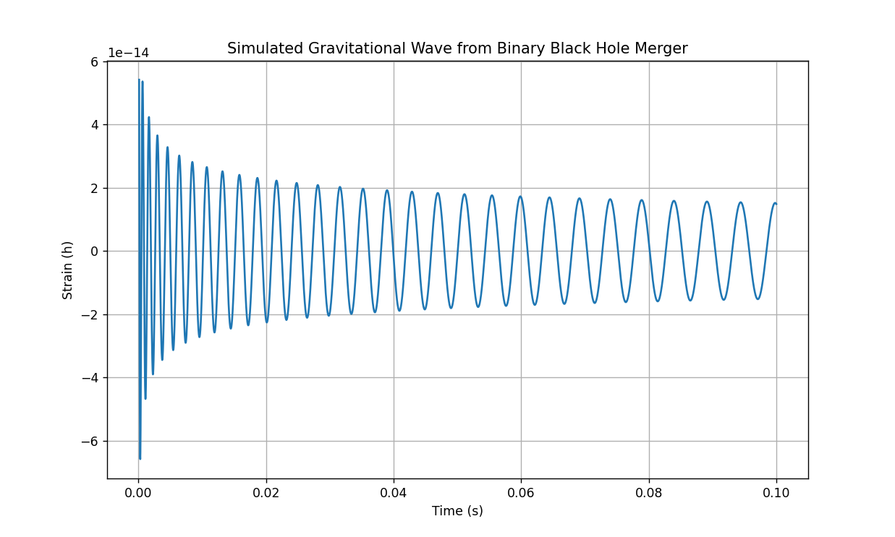

# Gravitational Waves Simulation from Binary Black Hole Mergers

This project simulates gravitational waves emitted from binary black hole mergers, utilizing concepts from general relativity and wave mechanics. It generates a time-series graph visualizing the waveform of these cosmic events.

## Requirements

To run this project, ensure you have the following Python packages installed:

- NumPy
- Matplotlib
- SciPy

## Output
The output is a time-series graph that displays the gravitational waveform generated during the merger of two black holes, illustrating how the signal evolves over time.

## Topics Covered
- General Relativity
- Wave Mechanics
- Gravitational Waves
- Numerical Simulations

## License
This project is licensed under the MIT License.
